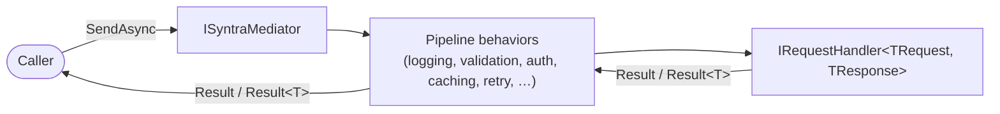

# Syntra

[](https://github.com/Bubenshi-Mike/syntra/actions/workflows/ci.yml)
[](https://www.nuget.org/packages/Syntra)
[](LICENSE)

Syntra is a **.NET 10** mediator-style library with **CQRS-friendly** requests, **railway-oriented** `Result` types, **pipeline behaviors**, **notifications**, and **streaming queries**. Optional **Roslyn analyzers** help keep registration and conventions consistent.

> **Target framework:** `net10.0`. **Repository:** [github.com/Bubenshi-Mike/syntra](https://github.com/Bubenshi-Mike/syntra).
>
> Pre-`v0.1.0`: not yet published to NuGet.org. The badges above will resolve once it is.

## Packages

| Package | Purpose |
|--------|---------|
| `Syntra.Abstractions` | Contracts: `IRequest`, `Result`, handlers, notifications, pipeline hooks. |
| `Syntra` | Mediator implementation, execution, options. |
| `Syntra.Behaviors` | Cross-cutting behaviors (validation, caching, retry, auth, audit, …). |
| `Syntra.DependencyInjection` | `AddSyntra`, Scrutor scanning, configuration binding. |
| `Syntra.Analyzers` | Roslyn analyzers (reference as analyzer; `PrivateAssets="all"`). |
| `Syntra.Diagnostics` | Opt-in tracing (`ActivitySource`) and metrics behaviors — enable with `.AddBehaviors(b => b.AddStandardPipeline().AddDiagnostics())`. |
| `Syntra.SourceGenerator` | Compile-time validation of handler registrations; generates a small build-time hint file, not full registration code — see [CHANGELOG](CHANGELOG.md). |

## How a request flows through Syntra



Streaming queries follow a parallel path through `CreateStreamAsync`, returning `IAsyncEnumerable<T>` instead of a single `Result`.

## Quick start

Reference the packages you need (typically **Abstractions**, **Syntra**, **Behaviors**, **DependencyInjection**):

```xml
<ItemGroup>
  <PackageReference Include="Syntra.Abstractions" Version="0.1.0" />
  <PackageReference Include="Syntra" Version="0.1.0" />
  <PackageReference Include="Syntra.Behaviors" Version="0.1.0" />
  <PackageReference Include="Syntra.DependencyInjection" Version="0.1.0" />
  <PackageReference Include="Syntra.Analyzers" Version="0.1.0" PrivateAssets="all" />
</ItemGroup>
```

```csharp
using Syntra.DependencyInjection.Extensions;
using Syntra.DependencyInjection.Registration;

builder.Services.AddSyntra(builder.Configuration, c => c
    .AddBehaviors(b => b.AddStandardPipeline())
    .ScanAssemblies(typeof(Program).Assembly));
```

See the `samples/` folder in this repository for **Web API**, **Console**, and **Worker** examples.

## Building & packing locally

```bash
dotnet test -c Release
dotnet pack -c Release -o ./artifacts
```

## Roadmap

Before a `v0.1.0` release:

- [ ] Publish to NuGet.org
- [ ] Merge the CI/quality-gate and OSS-hygiene work in progress (coverage, format checks, central package management, analyzer/generator test coverage, security audit)
- [ ] See [CHANGELOG](CHANGELOG.md) `Unreleased` for architecture changes already landed

## License

MIT — see [LICENSE](LICENSE).
